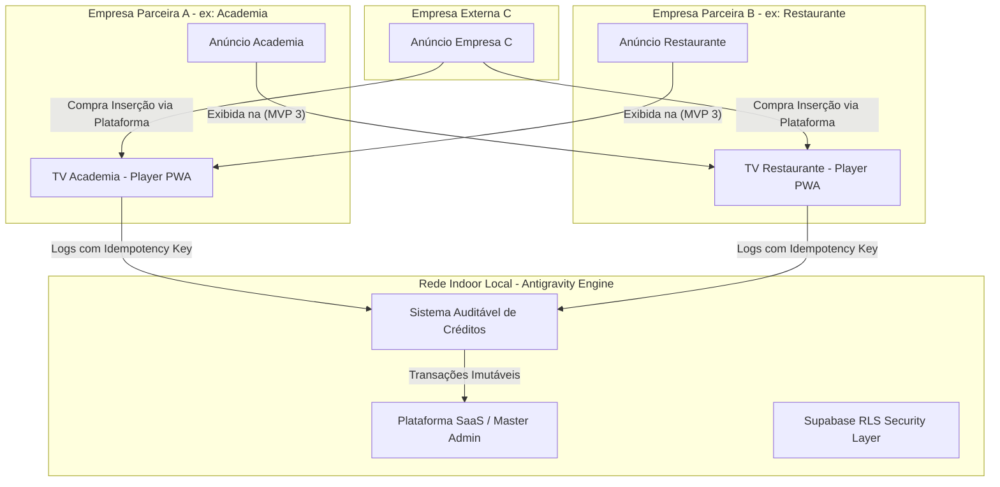
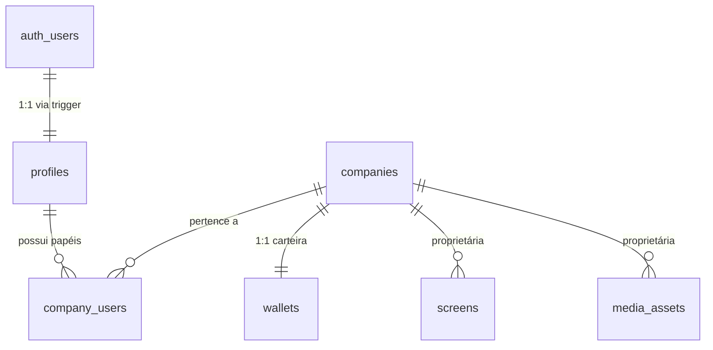
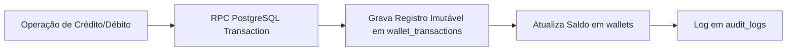
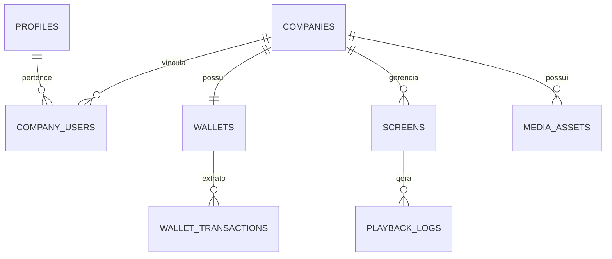

# Documento de Especificação Técnica e Funcional

## Nome Provisório do Projeto
**Rede Indoor Local**

> **Nomes Alternativos:** Vitrine Compartilhada | Rede Local de Telas | Mídia Parceira | Indoor Share | Tela Parceira

---

## 1. Visão Geral do Produto

O **Rede Indoor Local** é uma plataforma SaaS (*Software as a Service*) multiempresa (*Multi-tenant*) desenvolvida para gerenciar redes de **TV Mídia Indoor** (Digital Signage). 

Diferente dos sistemas tradicionais de mídia indoor que apenas gerenciam e reproduzem playlists de anúncios locais, o **Rede Indoor Local** opera como uma **rede descentralizada e compartilhada de mídias**. A plataforma permite que estabelecimentos comerciais e parceiros troquem audiência entre si, vendam espaços publicitários ociosos em suas telas ou comprem inserções em telas de terceiros em sua cidade ou região, utilizando um ecossistema de créditos, permutas, pacotes de inserções e cupons.



---

## 2. Proposta de Valor

> *"Não é apenas um sistema para passar propaganda em TV. É uma rede de divulgação local onde empresas parceiras podem trocar audiência, comprar inserções e aparecer em várias TVs da cidade pagando pouco ou usando créditos acumulados."*

### Diferenciais Competitivos
* **Rede Colaborativa de Telas:** Transformação de pontos de exibição individuais em uma grande rede de anúncios locais compartilhados.
* **Economia Baseada em Créditos Auditáveis:** Empresas ganham créditos ao ceder tempo de tela em seus estabelecimentos e usam esses créditos para veicular sua marca em outras empresas parceiras.
* **Segmentação Inteligente e Bloqueio Concorrencial:** Garantia de que concorrentes diretos ou conteúdos indesejados nunca sejam exibidos no estabelecimento parceiro.
* **Player Resiliente e Desacoplado:** Execução em navegadores/PWA com cache offline, envio idempotente de logs e pareamento simplificado por código.

---

## 3. Arquitetura Multi-tenant e Segurança com Supabase RLS

A segurança e o isolamento de dados no **Rede Indoor Local** são garantidos nativamente no nível do banco de dados PostgreSQL utilizando **Supabase Row Level Security (RLS)**.



### 3.1. Divisão de Autenticação e Perfis (`auth.users` vs `profiles`)
* **`auth.users` (Nativo do Supabase):** Utilizado **exclusivamente** para armazenar credenciais de acesso, e-mail, senha criptografada e tokens de autenticação (JWT). Nenhuma lógica de negócios ou dados adicionais do usuário é gravada nesta tabela.
* **`profiles` (Tabela Pública):** Vinculada 1:1 com `auth.users.id`. Armazena dados de perfil do usuário (`full_name`, `email`, `avatar_url`, `phone`, `is_master_admin`, `created_at`, `updated_at`).
  * Uma *Trigger* automática no PostgreSQL cria o registro em `profiles` sempre que um novo usuário confirma o cadastro via Supabase Auth.

### 3.2. Vínculo Multi-tenant (`companies` & `company_users`)
* **`companies`:** Tabela contendo os dados cadastrais das empresas (Tenants).
* **`company_users`:** Tabela de junção N:N que estabelece qual usuário pertence a qual empresa e qual a sua permissão (`role`).
  * Colunas principais: `id`, `company_id`, `user_id` (ref `profiles.id`), `role` (`admin`, `operator`, `external`), `is_active`, `created_at`.

### 3.3. Funções Helper em SQL para Políticas RLS
Para garantir alta performance e reuso nas políticas de RLS, são criadas Stored Functions no PostgreSQL:

```sql
-- Verifica se o usuário autenticado é Master Admin
CREATE OR REPLACE FUNCTION public.is_master_admin()
RETURNS BOOLEAN AS $$
  SELECT COALESCE((SELECT is_master_admin FROM public.profiles WHERE id = auth.uid()), FALSE);
$$ LANGUAGE sql SECURITY DEFINER STABLE;

-- Retorna a lista de IDs de empresas onde o usuário tem vínculo ativo
CREATE OR REPLACE FUNCTION public.get_user_company_ids()
RETURNS SETOF UUID AS $$
  SELECT company_id 
  FROM public.company_users 
  WHERE user_id = auth.uid() AND is_active = TRUE;
$$ LANGUAGE sql SECURITY DEFINER STABLE;
```

---

## 4. Perfis de Usuários e Matriz de Permissões (ACL)

### 4.1. Regras Detalhadas por Perfil

| Perfil | Escopo de Visualização | Ações Permitidas | Restrições Rígidas |
| :--- | :--- | :--- | :--- |
| **Master Admin** | **Global (Todas as empresas e tabelas)** | Gestão de empresas, aprovação global de mídias, criação de planos, auditoria de logs, concessão manual de créditos, configurações do sistema. | Nenhuma. Acesso liberado via RLS `is_master_admin() = true`. |
| **Admin Empresa** | **Exclusivo da própria Empresa (`company_id`)** | Gestão de usuários da empresa (`company_users`), cadastro de unidades/TVs, upload de mídias, criação de playlists, visualização da carteira de créditos e relatórios locais. | Não pode visualizar ou alterar dados de outras empresas. Não acessa configurações globais do sistema. |
| **Operador** | **Exclusivo da própria Empresa (Restrito)** | Upload de mídias da empresa, montagem e edição de playlists locais, consulta de status de TVs e logs básicos de exibição. | **Sem acesso a financeiro:** Não visualiza extratos bancários/créditos, não altera planos, não convida usuários, não altera regras RLS/bloqueios. |
| **Empresa Externa** | **Apenas dados e campanhas próprias** | Cadastro de anunciante, upload de mídias institucionais, compra de pacotes de créditos, criação e acompanhamento de campanhas pagas na rede. | Não possui cadastro de TVs. Não acessa inventário nem playlists de empresas parceiras. |
| **Player (Dispositivo)** | **Rota Anônima / Token de Dispositivo** | Leitura da playlist ativa vinculada à tela via `pairing_code` / `device_token` e envio de `playback_logs`. | **NÃO USA LOGIN DE USUÁRIO COMUM.** Não tem acesso a rotas administrativas nem tabelas de perfis/carteiras. |

---

## 5. Carteira de Créditos Auditável

Para evitar inconsistências financeiras, fraudes ou estouro de saldo, a carteira de créditos opera sob **regras estritas de imutabilidade e auditabilidade**.



### 5.1. Diretrizes de Segurança da Carteira
1. **Proibição de Alteração Direta (`UPDATE wallets` proibido via RLS):** Nenhuma consulta SQL comum ou chamada de API de cliente pode fazer `UPDATE` direto na coluna `balance` da tabela `wallets`.
2. **Execução Exclusiva via Stored Function (RPC):** Alterações de saldo só ocorrem mediante a execução de uma função segura no banco (`process_credit_transaction`).
3. **Registro de Extrato Imutável (`wallet_transactions`):** Toda e qualquer movimentação exige a gravação de um histórico contendo obrigatoriamente:
   * `id`: UUID único.
   * `wallet_id`: ID da carteira.
   * `company_id`: ID da empresa dona do saldo.
   * `previous_balance`: Saldo imediatamente anterior à transação.
   * `amount`: Valor movimentado (positivo para crédito, negativo para débito).
   * `new_balance`: Saldo resultante (`previous_balance` + `amount`).
   * `type`: Enum (`credit`, `debit`).
   * `source`: Enum (`manual_grant`, `purchase`, `exchange_earn`, `campaign_spend`, `refund`, `system_bonus`).
   * `description`: Texto explicativo da transação.
   * `user_id`: ID do usuário responsável pela ação (ou `NULL` se gerado por job do sistema).
   * `created_at`: Data e hora exatas com fuso horário.

---

## 6. Protection contra Duplicidade em Logs de Exibição (`idempotency_key`)

Smart TVs e players em estabelecimentos comerciais sofrem com instabilidade de rede e desconexões frequentes. Quando a conexão retorna, o player tenta enviar em lote os logs de exibição acumulados.

### 6.1. Mecanismo de Idempotência
Para impedir que a mesma exibição seja contabilizada múltiplas vezes (o que geraria cobrança duplicada e desgaste indesejado de créditos):

1. **Geração no Player Client-side:** Ao final da execução de cada mídia, o player gera uma chave única e determinística:
   $$\text{idempotency\_key} = \text{SHA256}(\text{screen\_id} + \text{media\_id} + \text{timestamp\_exibicao\_ms} + \text{random_uuid})$$
2. **Restrição `UNIQUE` no PostgreSQL:** A tabela `playback_logs` possui uma constraint única na coluna `idempotency_key`.
3. **Tratamento no Ingest de Logs:** Se o player tentar reenviar o mesmo log devido a um timeout de resposta HTTP, o banco de dados rejeita a duplicata silenciosamente (`ON CONFLICT (idempotency_key) DO NOTHING`), garantindo a integridade dos relatórios e do consumo de créditos.

---

## 7. Divisão Estratégica dos MVPs (Abordagem Incremental)

Para garantir entrefas rápidas, testáveis e seguras no Antigravity, o escopo foi dividido em **3 MVPs progressivos**.

```
┌─────────────────────────────────────────────────────────────────────────┐
│                          EVOLUÇÃO DOS MVPs                              │
├─────────────────────────┬───────────────────────┬───────────────────────┤
│ MVP 1                   │ MVP 2                 │ MVP 3                 │
│ Fundação SaaS           │ Dispositivos, Player  │ Campanhas, Créditos   │
│ Multiempresa & Auth     │ & Playlists           │ Permuta & Rede Ext.   │
└─────────────────────────┴───────────────────────┴───────────────────────┘
```

### 7.1. MVP 1 — Fundação SaaS Multiempresa
* **Escopo:**
  * Estrutura do projeto em Next.js (App Router), TypeScript e Tailwind CSS.
  * Integração com Supabase (Auth, Database, RLS).
  * Autenticação completa (Login, Registro, Recuperação de Senha).
  * Tabela `profiles` com sync automático via PostgreSQL Trigger.
  * Cadastro de Empresas (`companies`) e Segmentos (`segments`, `company_segments`).
  * Vínculo Multi-tenant (`company_users`) com controle de papéis (`admin`, `operator`, `external`).
  * Layout administrativo responsivo com Sidebar, Header e Seletor de Tenant.
  * Estrutura auditável de Carteira de Créditos (`wallets`, `wallet_transactions`) com RPC base.
  * Logs de auditoria administrativa (`audit_logs`).
  * Middleware de rotas protegidas por perfil.

### 7.2. MVP 2 — Telas, Mídias, Playlists e Player Web
* **Escopo:**
  * Cadastro e gerenciamento de TVs/Telas (`screens`).
  * Sistema de pareamento por código de 6 dígitos (`screen_pairing_codes`).
  * Upload de mídias para o Supabase Storage (imagens e vídeos de 5s, 10s, 15s, 30s) com validação de orientação.
  * Construtor e organizador de Playlists locais.
  * **Player Web PWA (`/player`):** Rota anônima desacoplada, suporte a tela cheia, execução contínua da playlist, armazenamento offline via Service Worker / IndexedDB.
  * Envio de logs de exibição (`playback_logs`) com proteção contra duplicidade (`idempotency_key`).

### 7.3. MVP 3 — Campanhas, Créditos, Permuta, Cupons e Rede Externa
* **Escopo:**
  * Regras de permissão de mídias externas por empresa e bloqueio por segmento/concorrente.
  * Cadastro de anunciante (Empresa Externa sem TV).
  * Motor de criação e direcionamento de Campanhas (por cidade, bairro e segmento).
  * Consumo automatizado da carteira de créditos por inserção reproduzida.
  * Rede de Permuta entre parceiros com acúmulo de créditos por exibição cedia.
  * Módulo de Cupons (Desconto e Indicação).
  * Relatórios consolidados de entregas e Prova de Exibição (*Proof of Play*).

### 7.4. Escopo Fora dos MVPs (Fases Futuras / Pós-MVP)
* [ ] Integração e consumo de Notícias via RSS / API externa (Não entra no MVP 1, 2 ou 3).
* [ ] Rateio financeiro em dinheiro corrente e funcionalidade de saque via PIX/TED (Priorizado repasse exclusivo via Créditos Internos).
* [ ] Automação avançada com IA para criação de artes ou resizing automático.
* [ ] Marketplace público aberto sem moderação prévia.

---

## 8. Critérios de Aceite por Fase

### 8.1. Critérios de Aceite — MVP 1
1. **Autenticação:** Um usuário pode se registrar e ter seu perfil criado automaticamente na tabela `profiles`.
2. **Isolamento RLS:** Um usuário do tipo `Admin Empresa` da "Empresa A" não consegue listar, editar ou deletar registros da "Empresa B".
3. **Multi-perfil:** O `Master Admin` consegue acessar o painel global e visualizar todas as empresas cadastradas.
4. **Segurança de Créditos:** Tentativa de `UPDATE` direto na tabela `wallets` via client Supabase retorna erro de permissão RLS; transações só ocorrem via função RPC e registram extrato em `wallet_transactions`.
5. **Auditoria:** Ações administrativas (criação de empresa, alteração de permissão) geram registros em `audit_logs`.

### 8.2. Critérios de Aceite — MVP 2
1. **Pareamento de Tela:** Uma TV sem login acessa `/player`, gera um código de 6 dígitos, e o Admin da empresa consegue parear essa tela pelo painel.
2. **Upload & Storage:** Mídias enviadas respeitam limites de tamanho e durações válidas (5s, 10s, 15s, 30s).
3. **Resiliência Offline:** Ao desconectar a internet do dispositivo player após o carregamento inicial, a playlist continua rodando em loop sem tela preta.
4. **Deduplicação de Logs:** O reenvio do mesmo payload de log com a mesma `idempotency_key` não duplica registros na tabela `playback_logs`.

### 8.3. Critérios de Aceite — MVP 3
1. **Bloqueio Concorrencial:** Mídias de empresas de segmento bloqueado (ex: outra academia) não são incluídas na playlist gerada para a TV da empresa parceira.
2. **Consumo de Créditos:** A cada inserção comprovadamente exibida de uma campanha paga, os créditos da carteira da empresa contratante são debitados e os créditos da empresa exibidora são creditados com registro atômico.
3. **Uso de Cupons:** Aplicação de cupom de desconto reduz o valor cobrado na aquisição de pacotes de inserções.

---

## 9. Estrutura Atualizada do Banco de Dados (Schema PostgreSQL / Supabase)



### Detalhamento das Tabelas Principais

#### 1. `profiles`
* `id` (UUID, PK, ref `auth.users.id` ON DELETE CASCADE)
* `email` (TEXT, UNIQUE, NOT NULL)
* `full_name` (TEXT)
* `avatar_url` (TEXT)
* `phone` (TEXT)
* `is_master_admin` (BOOLEAN, DEFAULT FALSE)
* `created_at` (TIMESTAMPTZ, DEFAULT NOW())
* `updated_at` (TIMESTAMPTZ, DEFAULT NOW())

#### 2. `companies`
* `id` (UUID, PK, DEFAULT gen_random_uuid())
* `trade_name` (TEXT, NOT NULL) -- Nome Fantasia
* `corporate_name` (TEXT) -- Razão Social
* `cnpj` (TEXT, UNIQUE)
* `city` (TEXT, NOT NULL)
* `state` (TEXT, NOT NULL)
* `neighborhood` (TEXT)
* `address` (TEXT)
* `accepts_external_media` (BOOLEAN, DEFAULT TRUE)
* `accepts_exchange` (BOOLEAN, DEFAULT TRUE)
* `created_at` (TIMESTAMPTZ, DEFAULT NOW())
* `updated_at` (TIMESTAMPTZ, DEFAULT NOW())

#### 3. `company_users`
* `id` (UUID, PK, DEFAULT gen_random_uuid())
* `company_id` (UUID, FK `companies.id` ON DELETE CASCADE)
* `user_id` (UUID, FK `profiles.id` ON DELETE CASCADE)
* `role` (TEXT, NOT NULL CHECK (role IN ('admin', 'operator', 'external')))
* `is_active` (BOOLEAN, DEFAULT TRUE)
* `created_at` (TIMESTAMPTZ, DEFAULT NOW())
* UNIQUE(`company_id`, `user_id`)

#### 4. `segments` & `company_segments`
* `segments`: `id` (UUID, PK), `name` (TEXT), `description` (TEXT), `icon` (TEXT).
* `company_segments`: `company_id` (UUID), `segment_id` (UUID), `is_primary` (BOOLEAN).

#### 5. `wallets` & `wallet_transactions`
* `wallets`: `id` (UUID, PK), `company_id` (UUID, FK `companies.id`, UNIQUE), `balance` (NUMERIC(12,2), DEFAULT 0.00), `updated_at` (TIMESTAMPTZ).
* `wallet_transactions`: `id` (UUID, PK), `wallet_id` (UUID), `company_id` (UUID), `previous_balance` (NUMERIC), `amount` (NUMERIC), `new_balance` (NUMERIC), `type` (TEXT), `source` (TEXT), `description` (TEXT), `user_id` (UUID, NULLABLE), `created_at` (TIMESTAMPTZ).

#### 6. `screens` & `screen_pairing_codes`
* `screens`: `id` (UUID, PK), `company_id` (UUID), `name` (TEXT), `orientation` (TEXT), `resolution` (TEXT), `status` (TEXT), `device_token` (TEXT, UNIQUE), `last_ping_at` (TIMESTAMPTZ).
* `screen_pairing_codes`: `id` (UUID, PK), `code` (VARCHAR(6), UNIQUE), `screen_id` (UUID, NULLABLE), `expires_at` (TIMESTAMPTZ).

#### 7. `playback_logs`
* `id` (UUID, PK), `screen_id` (UUID), `media_id` (UUID), `company_id` (UUID), `idempotency_key` (TEXT, UNIQUE, NOT NULL), `duration_seconds` (INTEGER), `played_at` (TIMESTAMPTZ).

#### 8. `audit_logs`
* `id` (UUID, PK), `user_id` (UUID, NULLABLE), `company_id` (UUID, NULLABLE), `action` (TEXT, NOT NULL), `details` (JSONB), `ip_address` (TEXT), `created_at` (TIMESTAMPTZ).

---

## 10. Modelo de Monetização (Resumo de Planos SaaS)

| Plano | Valor | Descrição |
| :--- | :--- | :--- |
| **Starter** | R$ 49/mês | 1 TV cadastrada; mídias próprias ilimitadas; sem permuta. |
| **Local** | R$ 99/mês | Até 2 TVs; acesso à permuta local; 500 créditos/mês. |
| **Pro** | R$ 199/mês | Até 5 TVs; permuta estadual; 1.500 créditos/mês; relatórios completos. |
| **Rede** | R$ 499/mês | Multiunidades; TVs ilimitadas (sob consulta); suporte prioritário. |

---

## 11. Cuidados e Riscos Técnicos

1. **Instabilidade de Conexão no Player:** O player web deve ser isolado contra falhas de rede, armazenando a playlist em IndexedDB e usando Service Workers para mídias locais.
2. **Integridade da Carteira de Créditos:** Inexistência de alteração manual de saldo via API sem RPC e log de transação imutável.
3. **Deduplicação de Logs de Exibição:** Obrigatoriedade da restrição `UNIQUE(idempotency_key)` na ingestão de logs.

---

## 12. Plano de Execução da Fase 1 no Antigravity

Esta seção descreve o plano técnico detalhado para a implementação da **Fase 1 (MVP 1 — Fundação SaaS Multiempresa)** na plataforma Antigravity.

```
┌─────────────────────────────────────────────────────────────────────────┐
│                 PLANO DE EXECUÇÃO FASE 1 - ANTIGRAVITY                  │
├────────────────────────────────┬────────────────────────────────────────┤
│ 1. Setup Next.js 14+ & TS      │ App Router, Tailwind CSS, Lucide Icons │
├────────────────────────────────┼────────────────────────────────────────┤
│ 2. Integração Supabase Client  │ `@supabase/ssr` (Server & Client Auth) │
├────────────────────────────────┼────────────────────────────────────────┤
│ 3. Script SQL & RLS            │ Migração de Tabelas, Triggers & RLS    │
├────────────────────────────────┼────────────────────────────────────────┤
│ 4. Fluxo de Autenticação       │ Login, Registro, Profile Sync          │
├────────────────────────────────┼────────────────────────────────────────┤
│ 5. Middleware de Proteção      │ Redirecionamento por Perfil/Tenant     │
├────────────────────────────────┼────────────────────────────────────────┤
│ 6. Layout Administrativo Base  │ Sidebar Responsiva, Header, AppShell   │
├────────────────────────────────┼────────────────────────────────────────┤
│ 7. Módulo Empresa & Segmentos  │ Onboarding de Empresa e Segmentos      │
├────────────────────────────────┼────────────────────────────────────────┤
│ 8. Carteira & Audit Logs       │ Tabela Visual, RPC Base e Logger       │
└────────────────────────────────┴────────────────────────────────────────┘
```

### 12.1. Componentes e Estrutura de Arquivos a Serem Criados
* `src/app/`
  * `(auth)/login/page.tsx` — Tela de login com e-mail/senha.
  * `(auth)/register/page.tsx` — Cadastro de usuário e perfil inicial.
  * `(dashboard)/layout.tsx` — App Shell com Sidebar, Header e Contexto da Empresa ativa.
  * `(dashboard)/dashboard/page.tsx` — Visão geral da conta/estatísticas.
  * `(dashboard)/companies/page.tsx` — Gestão/Onboarding da empresa.
  * `(dashboard)/wallet/page.tsx` — Visualização auditável da carteira e transações.
  * `(dashboard)/admin/page.tsx` — Painel do Master Admin (gestão global).
* `src/lib/supabase/`
  * `client.ts` — Supabase Browser Client.
  * `server.ts` — Supabase Server Client (para Server Components e Server Actions).
  * `middleware.ts` — Tratamento de sessão e proteção de rotas.
* `src/middleware.ts` — Middleware global do Next.js.
* `supabase/migrations/001_initial_schema.sql` — Script SQL completo contendo:
  * Criação das extensões (`uuid-ossp`).
  * Tabelas: `profiles`, `companies`, `company_users`, `segments`, `company_segments`, `wallets`, `wallet_transactions`, `audit_logs`.
  * Triggers automatizadas (`handle_new_user` para popular `profiles` e criar `wallets`).
  * Functions SQL (`is_master_admin()`, `get_user_company_ids()`, `process_credit_transaction()`).
  * Políticas de RLS habilitadas para todas as tabelas.

### 12.2. Sequência de Execução Técnica na Fase 1
1. **Inicialização do Repositório:** Criar projeto Next.js com App Router, TypeScript, Tailwind CSS e ESLint no diretório do workspace.
2. **Configuração de Variáveis de Ambiente:** Configurar `.env.local` com `NEXT_PUBLIC_SUPABASE_URL` e `NEXT_PUBLIC_SUPABASE_ANON_KEY`.
3. **Execução das Migrações SQL:** Criar a estrutura completa do banco de dados no Supabase com suporte a RLS e triggers.
4. **Implementação do Supabase SSR & Auth:** Configurar leitores de cookies para Server Components e formulários de login/registro.
5. **Construção do Middleware de Rotas:** Bloquear acesso anônimo às rotas do dashboard e direcionar o Master Admin e Administradores de Empresa adequadamente.
6. **Desenvolvimento da Interface Administrativa:** Construir o layout responsivo com suporte a modo escuro/claro e navegação fluida.
7. **Verificação dos Critérios de Aceite da Fase 1:** Testar isolamento multi-tenant, registro de perfil e auditoria de transações antes de encerrar a fase.
