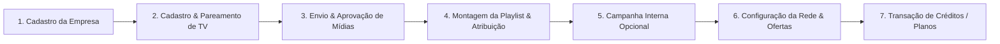

# Manual de Utilização da Plataforma — Rede Indoor Local

Este manual descreve a **ordem lógica de cadastros e liberações** para operação da plataforma, bem como o fluxo exclusivo do **Master Admin** para concessão de **gratuidade de uso, planos ilimitados e degustação (trials)** para empresas parceiras.

---

## 1. Ordem Lógica de Cadastros e Liberações (Fluxo Operacional)

Para colocar a rede de mídias para funcionar corretamente sem erros, siga a sequência abaixo:

### Passo 1: Cadastro da Empresa (Tenant)
* **Onde:** `/companies/new` ou ao registrar um novo usuário.
* **O que faz:** Cria a organização proprietária das telas, mídias e carteira de créditos.
* **Liberação:** Assim que criada, a empresa ganha uma carteira (`wallets`) vinculada.

---

### Passo 2: Cadastrar Nova TV / Tela e Realizar Pareamento
* **Onde:** `/screens/new`
* **O que faz:** Cadastra o nome da TV (ex: "Recepção") e sua orientação (Horizontal 16:9 ou Vertical 9:16).
* **Como parear:** Abra `https://midiapormidia.com.br/tv` na Smart TV ou navegador. O endereço exibe um código de 6 caracteres. Abra a TV cadastrada no painel e informe esse código no campo de pareamento.
* **Endereço de reprodução:** O mesmo `/tv` usado no pareamento permanece aberto para reproduzir playlists e campanhas. Não é necessário trocar de link depois do vínculo.

---

### Passo 3: Envio de Mídias (Biblioteca) & Moderação
* **Onde:** `/media/new`
* **O que faz:** Upload de vídeos (MP4) ou imagens (JPG/PNG) de 5s, 10s, 15s ou 30s.
* **Liberação/Moderação:** Toda mídia entra inicialmente em `pending_review` (Rascunho/Análise).
  * O **Admin da Empresa** ou o **Master Admin** aprova a mídia na tela `/media`. Somente mídias com status **Aprovada (`approved`)** podem ir para as TVs.

---

### Passo 4: Criar Playlist & Vincular à TV
* **Onde:** `/playlists/new`
* **O que faz:** Cria a grade de programação, adiciona as mídias aprovadas e define a ordem de exibição.
* **Vínculo:** Ative a playlist e, em `/screens/[id]`, atribua-a à TV criada no Passo 2. O player atualiza automaticamente a programação.

---

### Passo 5: Criar Campanha Interna (Opcional)
* **Onde:** `/campaigns/new`
* **O que faz:** Programa uma ou mais mídias aprovadas para TVs específicas, com período e meta de inserções.
* **Ordem obrigatória:** Crie o rascunho, abra a campanha, adicione ao menos uma mídia aprovada, adicione ao menos uma TV e clique em **Ativar Campanha**.
* **Exibição:** Uma campanha `active`, dentro do período configurado, entra automaticamente no loop do mesmo player `/tv`, junto da playlist ativa quando houver.

---

### Passo 5B: Intercalar Conteúdo de Respiro Manual e RSS (Opcional)
* **Conteúdo manual (Master):** acesse `/admin/informative-content`, clique em **Novo conteúdo manual**, preencha título, resumo curto, categoria e período. Conteúdo global com status `active` pode ser selecionado pelas TVs.
* **Fonte RSS (Master):** acesse `/admin/content-sources`, cadastre a URL do feed, configure intervalo, expiração e aprovação. Use **Testar busca** antes de salvar e **Importar** para buscar notícias no servidor.
* **Aprovação de notícias:** fontes que exigem revisão criam itens `pending_review`. Em `/admin/informative-content`, use **Aprovar** ou **Rejeitar**. Somente itens `approved`/`active`, dentro da validade, entram na TV.
* **Ativação por TV:** abra `/screens/[id]`, clique em **Conteúdo de Respiro**, ative a função, escolha 3, 4 ou 5 propagandas entre cards, habilite Manual/RSS e informe categorias opcionais.
* **Importação automática:** configure `CRON_SECRET` no servidor e agende uma chamada `GET /api/cron/rss` com o cabeçalho `Authorization: Bearer <CRON_SECRET>`. Cada fonte só é processada quando vence seu intervalo.
* **Separação comercial:** cards informativos usam `screen_content_logs`; não entram em `playback_logs`, não consomem créditos e não geram cobrança ou payout.

---

### Passo 6: Inventário de Rede & Publicação de Ofertas no Marketplace
* **Onde:** `/network-settings` e `/ad-offers/new`
* **O que faz:** Define se a empresa aceita exibir mídias de parceiros externos ou permuta. Cria os Planos de Mídia (ex: "100 exibições/dia por R$ 150/mês").
* **Aprovação Master:** O Master Admin homologa a oferta em `/admin/ad-offers` para aparecer no Marketplace público (`/marketplace`).

---

## 2. Como Conceder Uso Gratuito e Ilimitado (Fluxo Master Admin)

O **Master Admin** tem controle total para liberar o uso da plataforma de forma **gratuita**, seja por **tempo determinado (Cupom/Degustação)** ou de forma **ilimitada/vitalícia**.

---

### Opção A: Gratuidade por Tempo Determinado (Degustação / Trial / Cupom)
Utilize este fluxo quando quiser dar **X dias de teste grátis** (ex: 30 dias, 60 dias, 365 dias) para uma empresa.

1. Acesse a tela de **Gestão de Degustações**: `/trials`
2. Clique em **"Iniciar Novo Trial / Degustação"**.
3. Selecione a **Empresa Beneficiada** e informe a **Duração em Dias** (ex: `30` ou `365`).
4. Durante esse período:
   * A empresa veicula mídias nas telas sem ser cobrada.
   * O sistema exibe o status de degustação com contagem regressiva de dias.
   * Ao final do período, você pode renovar o Trial ou converter em plano pago.

---

### Opção B: Gratuidade Ilimitada / Concessão Manual de Créditos
Utilize este fluxo quando quiser conceder **uso gratuito ilimitado ou saldo livre** para a empresa utilizar sem restrição de prazo.

1. Acesse o painel de **Concessão de Créditos**: `/admin/credits`
2. Selecione a **Empresa**.
3. No campo de concessão:
   * **Tipo:** `Crédito`
   * **Origem:** `Concessão Manual (manual_grant)` ou `Bônus do Sistema (system_bonus)`
   * **Quantidade de Créditos:** Insira um valor elevado para saldo ilimitado (ex: `999.999` créditos).
   * **Descrição:** `"Isenção de tarifa - Parceria VIP Ilimitada"`.
4. Clique em **Conceder Créditos**. O saldo fica disponível imediatamente na carteira da empresa e nunca expira.

---

### Opção C: Cadastro Financeiro Isento para Exibidores VIP
1. Acesse o painel **Perfis Financeiros Exibidores**: `/admin/seller-financial-profiles`
2. O Master Admin pode aprovar diretamente o cadastro financeiro da empresa parceira sem exigir dados bancários de cobrança.

---

## 3. Resolução de Erros de Banco de Dados

### Erro Corrigido: `infinite recursion detected in policy for relation "company_users"`
Se essa mensagem aparecer ao tentar cadastrar uma TV ou empresa, significa que a regra de segurança RLS da tabela de usuários estava em loop. 

**Solução:** Execute o script unificado atualizado **[consolidated_schema.sql](file:///c:/Users/msdfe/Downloads/TV-MIDIA-NETEWORK/supabase/consolidated_schema.sql)** no Supabase SQL Editor para aplicar a função `get_user_admin_company_ids()` com `SECURITY DEFINER`, que elimina a recursão no banco.
